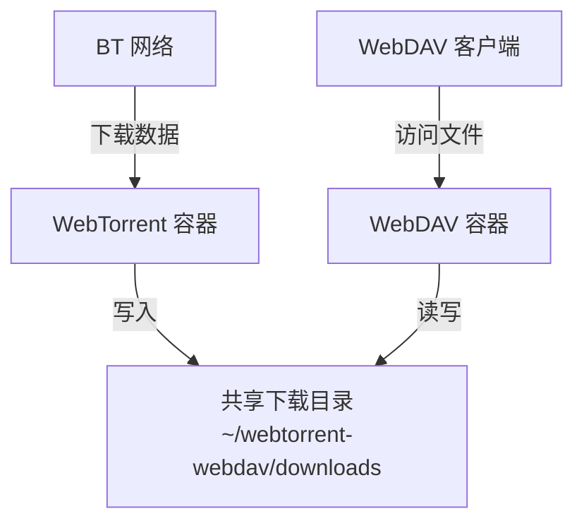

# WebTorrent + WebDAV 整合部署方案

## 方案概述

本方案通过 Docker 容器同时部署 WebTorrent 和 WebDAV 服务，实现：

- **自动化下载**：使用 WebTorrent 进行多任务并行 BT 下载
- **远程访问**：通过 WebDAV 协议实时访问下载的文件
- **跨平台支持**：在 PC、手机、平板等设备上随时查看和获取下载内容

### 架构说明

采用两个独立 Docker 容器共享同一数据目录的架构：



- **WebTorrent 容器**：负责 BT 下载任务，将文件保存到共享目录
- **WebDAV 容器**：提供文件访问服务，可实时查看下载进度和访问已完成的文件
- **共享目录**：两个容器通过 Docker 卷挂载访问同一目录

## 统一目录结构

### 创建目录

在宿主机上创建统一的项目目录：

```bash
mkdir -p ~/webtorrent-webdav/{downloads,logs,config}
```

### 目录说明

- `~/webtorrent-webdav/downloads/`：共享下载目录，WebTorrent 写入、WebDAV 读取
- `~/webtorrent-webdav/logs/`：WebTorrent 任务日志存储目录
- `~/webtorrent-webdav/config/`：WebDAV 配置文件存储目录

## 部署步骤

### 1. 准备工作

确保已安装 Docker：

```bash
# 检查 Docker 版本
docker --version

# 如果未安装，请参考 Docker 官方文档进行安装
```

创建项目目录：

```bash
mkdir -p ~/webtorrent-webdav/{downloads,logs,config}
cd ~/webtorrent-webdav
```

### 2. 构建 WebTorrent 镜像

构建预装 webtorrent-cli 的 Docker 镜像。创建一个临时目录并执行以下步骤：

```bash
# 创建临时工作目录
mkdir -p /tmp/webtorrent-build && cd /tmp/webtorrent-build

# 创建 Dockerfile
cat > Dockerfile << 'EOF'
FROM node:lts

# 全局安装 webtorrent-cli
RUN npm install -g webtorrent-cli

# 设置工作目录
WORKDIR /downloads

# 不设置 ENTRYPOINT，允许灵活使用 bash 执行复杂命令
# 容器启动时可以直接运行 bash -c "..." 或其他命令
EOF

# 创建 .dockerignore
cat > .dockerignore << 'EOF'
node_modules
npm-debug.log
.git
.gitignore
README.md
*.md
.vscode
.idea
*.log
.DS_Store
EOF

# 创建镜像构建脚本
cat > build-image.sh << 'EOF'
#!/bin/bash

# WebTorrent CLI 镜像构建脚本

set -e

IMAGE_NAME="webtorrent-cli"
IMAGE_TAG="latest"
FULL_IMAGE_NAME="${IMAGE_NAME}:${IMAGE_TAG}"

echo "开始构建 ${FULL_IMAGE_NAME} 镜像..."

# 构建镜像
docker build -t "${FULL_IMAGE_NAME}" .

echo ""
echo "镜像构建完成！"
echo ""
echo "镜像信息:"
docker images "${IMAGE_NAME}"

echo ""
echo "使用方法:"
echo "  启动下载任务:"
echo "  docker run -d --name webtorrent-task-1 --restart unless-stopped --network host \\"
echo "    -v ~/webtorrent/downloads:/downloads -v ~/webtorrent/logs:/logs \\"
echo "    ${FULL_IMAGE_NAME} 'magnet:?xt=urn:btih:YOUR_LINK' > /logs/task-1.log 2>&1"
EOF

chmod +x build-image.sh

# 构建镜像
./build-image.sh

# 构建完成后可以删除临时目录（可选）
# cd ~ && rm -rf /tmp/webtorrent-build
```

**镜像说明：**

- 基于 `node:lts` 官方镜像
- 预装 `webtorrent-cli`（避免每次启动时安装）
- 启动速度更快，资源利用更高效

### 3. 配置 WebDAV 服务

创建 WebDAV 配置文件：

```bash
cat > ~/webtorrent-webdav/config/config.yml << 'EOF'
address: 0.0.0.0
port: 6065
directory: /downloads
permissions: CRUD
debug: false

log:
  format: console
  colors: true
  outputs:
    - stderr

users:
  - username: admin
    password: admin
    permissions: CRUD
EOF
```

**配置说明：**

- `port: 6065`：WebDAV 服务端口
- `directory: /downloads`：容器内数据目录（映射到宿主机共享下载目录）
- `permissions: CRUD`：完整的创建、读取、更新、删除权限
- `users`：访问用户列表，**强烈建议修改默认密码**

验证配置文件：

```bash
cat ~/webtorrent-webdav/config/config.yml
```

### 4. 启动 WebDAV 容器

拉取镜像：

```bash
docker pull ghcr.io/hacdias/webdav:latest
```

启动 WebDAV 服务：

```bash
docker run -d \
  --name webdav \
  -p 6065:6065 \
  -v ~/webtorrent-webdav/config/config.yml:/config.yml:ro \
  -v ~/webtorrent-webdav/downloads:/downloads \
  --restart unless-stopped \
  ghcr.io/hacdias/webdav:latest -c /config.yml
```

**参数说明：**

- `-d`：后台运行
- `--name webdav`：容器名称
- `-p 6065:6065`：端口映射（宿主机:容器）
- `-v ~/webtorrent-webdav/config/config.yml:/config.yml:ro`：挂载配置文件（只读）
- `-v ~/webtorrent-webdav/downloads:/downloads`：挂载共享下载目录（读写）
- `--restart unless-stopped`：自动重启策略

验证 WebDAV 服务：

```bash
# 检查容器状态
docker ps | grep webdav

# 查看日志
docker logs webdav
```

### 5. 启动 WebTorrent 下载任务

启动第一个下载任务：

```bash
docker run -d \
  --name webtorrent-task-1 \
  --restart unless-stopped \
  --network host \
  -v ~/webtorrent-webdav/downloads:/downloads \
  -v ~/webtorrent-webdav/logs:/logs \
  webtorrent-cli:latest \
  bash -c "cd /downloads && \
           webtorrent 'magnet:?xt=urn:btih:YOUR_MAGNET_LINK_HERE' \
           > /logs/task-1.log 2>&1"
```

**参数说明：**

- `--name webtorrent-task-1`：任务容器名称（使用编号便于管理）
- `--network host`：使用宿主机网络，确保 BT 流量正常
- `-v ~/webtorrent-webdav/downloads:/downloads`：挂载共享下载目录（与 WebDAV 同一目录）
- `-v ~/webtorrent-webdav/logs:/logs`：挂载日志目录
- `> /logs/task-1.log 2>&1`：将输出重定向到独立日志文件

**请将 `YOUR_MAGNET_LINK_HERE` 替换为实际的磁力链接。**

### 5. 验证整合效果

**通过 WebDAV 客户端访问：**

- URL: `http://localhost:6065`
- 用户名: `admin`
- 密码: `admin`

**macOS Finder 连接：**

1. 打开 Finder
2. 按 `Cmd + K`
3. 输入: `http://localhost:6065`
4. 输入用户名和密码
5. 连接后可实时查看 WebTorrent 下载的文件

**Windows 资源管理器连接：**

1. 右键"此电脑" → "映射网络驱动器"
2. 输入: `http://localhost:6065`
3. 输入用户名和密码
4. 映射后可像本地磁盘一样访问

**查看下载进度：**

```bash
# 查看下载任务日志
tail -f ~/webtorrent-webdav/logs/task-1.log

# 查看下载目录内容
ls -lh ~/webtorrent-webdav/downloads/
```

## 使用场景

### 场景 1：批量下载 + 远程管理

在服务器上批量启动下载任务，通过 WebDAV 在本地电脑或手机上实时查看下载进度：

```bash
# 服务器端：启动多个下载任务
docker run -d --name webtorrent-task-2 --restart unless-stopped --network host \
  -v ~/webtorrent-webdav/downloads:/downloads -v ~/webtorrent-webdav/logs:/logs \
  webtorrent-cli:latest bash -c "cd /downloads && \
  webtorrent 'magnet:?xt=urn:btih:LINK_2' > /logs/task-2.log 2>&1"

docker run -d --name webtorrent-task-3 --restart unless-stopped --network host \
  -v ~/webtorrent-webdav/downloads:/downloads -v ~/webtorrent-webdav/logs:/logs \
  webtorrent-cli:latest bash -c "cd /downloads && \
  webtorrent 'magnet:?xt=urn:btih:LINK_3' > /logs/task-3.log 2>&1"

# 客户端：通过 WebDAV 访问 http://服务器IP:6065
```

### 场景 2：移动设备实时访问

在手机或平板上使用 WebDAV 客户端（如 FE File Explorer、Owlfiles 等）访问下载文件：

1. 在 WebDAV 客户端中添加服务器
2. 输入服务器地址: `http://服务器IP:6065`
3. 输入用户名和密码
4. 实时查看和播放已下载的文件

### 场景 3：自动化工作流

结合脚本实现自动化下载和分发：

```bash
# 创建批量下载函数
add_download() {
  local task_name=$1
  local magnet_link=$2
  
  docker run -d \
    --name "webtorrent-${task_name}" \
    --restart unless-stopped \
    --network host \
    -v ~/webtorrent-webdav/downloads:/downloads \
    -v ~/webtorrent-webdav/logs:/logs \
    webtorrent-cli:latest \
    bash -c "cd /downloads && \
             webtorrent '${magnet_link}' \
             > /logs/${task_name}.log 2>&1"
  
  echo "任务 ${task_name} 已启动，可通过 WebDAV 访问下载目录"
}

# 使用示例
add_download "movie-2024" "magnet:?xt=urn:btih:..."
```

## 管理和维护

### WebTorrent 任务管理

**查看所有下载任务：**

```bash
# 查看正在运行的任务
docker ps | grep webtorrent-task

# 查看所有任务（包括已停止的）
docker ps -a | grep webtorrent-task

# 查看已完成的下载任务（已退出）
docker ps -a --filter "name=webtorrent-task" --filter "status=exited"
```

**容器生命周期说明：**

- 运行中：下载进行中的容器状态为 `Up`
- 已完成：下载完成后，容器会继续运行
- 只有异常退出（非 0 状态码）时容器才会自动重启

**添加新的下载任务：**

```bash
docker run -d \
  --name webtorrent-task-N \
  --restart unless-stopped \
  --network host \
  -v ~/webtorrent-webdav/downloads:/downloads \
  -v ~/webtorrent-webdav/logs:/logs \
  webtorrent-cli:latest \
  bash -c "cd /downloads && \
           webtorrent 'magnet:?xt=urn:btih:NEW_LINK' \
           > /logs/task-N.log 2>&1"
```

**停止和删除任务：**

```bash
# 停止特定任务
docker stop webtorrent-task-1

# 删除特定任务
docker rm webtorrent-task-1

# 批量删除已完成的任务
docker ps -aq --filter "name=webtorrent-task" --filter "status=exited" | xargs -r docker rm
```

**查看下载进度：**

```bash
# 查看特定任务日志
tail -f ~/webtorrent-webdav/logs/task-1.log

# 同时查看所有任务日志
tail -f ~/webtorrent-webdav/logs/*.log
```

### WebDAV 服务管理

**基本管理命令：**

```bash
# 停止 WebDAV 服务
docker stop webdav

# 启动 WebDAV 服务
docker start webdav

# 重启 WebDAV 服务
docker restart webdav

# 查看 WebDAV 日志
docker logs -f webdav

# 删除 WebDAV 容器
docker rm -f webdav
```

**修改配置：**

```bash
# 编辑配置文件
vi ~/webtorrent-webdav/config/config.yml

# 重启服务使配置生效
docker restart webdav
```

### 日志查看和故障排查

**检查服务状态：**

```bash
# 查看所有相关容器
docker ps -a | grep -E "webdav|webtorrent"

# 检查端口占用
lsof -i :6065
```

**查看磁盘使用：**

```bash
# 查看下载目录大小
du -sh ~/webtorrent-webdav/downloads/

# 查看日志目录大小
du -sh ~/webtorrent-webdav/logs/
```

**常见问题排查：**

#### 问题 1：WebDAV 无法访问

```bash
# 检查容器是否运行
docker ps | grep webdav

# 查看容器日志
docker logs webdav

# 检查端口是否监听
netstat -tuln | grep 6065
```

#### 问题 2：WebTorrent 下载失败

```bash
# 查看任务日志
tail -100 ~/webtorrent-webdav/logs/task-1.log

# 检查网络连接
docker exec webtorrent-task-1 ping -c 3 8.8.8.8
```

#### 问题 3：权限问题

```bash
# 确保下载目录有正确的权限
chmod -R 755 ~/webtorrent-webdav/downloads/

# 检查目录所有者
ls -ld ~/webtorrent-webdav/downloads/
```

## 注意事项和最佳实践

### 安全性建议

1. **修改默认密码**

   编辑配置文件，使用强密码：

   ```bash
   vi ~/webtorrent-webdav/config/config.yml
   ```

   ```yaml
   users:
     - username: admin
       password: "your_strong_password_here"
   ```

2. **使用加密密码**

   生成 bcrypt 加密密码：

   ```bash
   docker run --rm -it ghcr.io/hacdias/webdav:latest bcrypt
   ```

   将生成的密码更新到配置文件：

   ```yaml
   users:
     - username: admin
       password: "{bcrypt}$2y$10$..."
   ```

3. **限制访问范围**

   仅本地访问时，修改配置文件：

   ```yaml
   address: 127.0.0.1
   ```

4. **使用 HTTPS**

   生产环境建议使用反向代理（如 Nginx）配置 HTTPS。

### 性能优化建议

1. **限制并发下载数量**

   避免同时运行过多下载任务，建议控制在 3-5 个以内。

2. **定期清理日志**

   ```bash
   # 清空日志文件但保留文件
   > ~/webtorrent-webdav/logs/task-1.log

   # 或删除旧日志
   find ~/webtorrent-webdav/logs/ -name "*.log" -mtime +7 -delete
   ```

3. **监控磁盘空间**

   ```bash
   # 设置磁盘使用提醒
   df -h | grep -E "/$|/home"
   ```

### 权限配置建议

1. **WebDAV 只读模式**

   如果只需要通过 WebDAV 查看文件，可设置为只读：

   ```yaml
   users:
     - username: viewer
       password: "password"
       permissions: R
   ```

2. **多用户配置**

   ```yaml
   users:
     - username: admin
       password: "admin_password"
       permissions: CRUD
     - username: viewer
       password: "viewer_password"
       permissions: R
   ```

### 备份建议

定期备份配置文件和重要下载：

```bash
# 备份配置文件
cp ~/webtorrent-webdav/config/config.yml ~/webtorrent-webdav/config/config.yml.bak

# 压缩备份下载目录
tar -czf ~/webtorrent-webdav-backup-$(date +%Y%m%d).tar.gz ~/webtorrent-webdav/downloads/
```

### 资源限制建议

限制容器资源使用：

```bash
# 限制 WebTorrent 容器内存和 CPU
docker run -d \
  --name webtorrent-task-1 \
  --memory="2g" \
  --cpus="2" \
  --restart unless-stopped \
  --network host \
  -v ~/webtorrent-webdav/downloads:/downloads \
  -v ~/webtorrent-webdav/logs:/logs \
  webtorrent-cli:latest \
  bash -c "cd /downloads && \
  webtorrent 'magnet:?xt=urn:btih:LINK' > /logs/task-1.log 2>&1"
```

## 完整部署脚本

将以下内容保存为 `deploy.sh`，一键部署整个环境：

```bash
#!/bin/bash

# 创建目录结构
echo "创建目录结构..."
mkdir -p ~/webtorrent-webdav/{downloads,logs,config}

# 创建 WebDAV 配置文件
echo "创建 WebDAV 配置文件..."
cat > ~/webtorrent-webdav/config/config.yml << 'EOF'
address: 0.0.0.0
port: 6065
directory: /downloads
permissions: CRUD
debug: false

log:
  format: console
  colors: true
  outputs:
    - stderr

users:
  - username: admin
    password: admin
    permissions: CRUD
EOF

# 拉取镜像
echo "拉取 Docker 镜像..."
docker pull ghcr.io/hacdias/webdav:latest

# 构建 WebTorrent 镜像
echo "构建 WebTorrent 镜像..."
BUILD_DIR="/tmp/webtorrent-build"
mkdir -p ${BUILD_DIR}

cat > ${BUILD_DIR}/Dockerfile << 'EOF'
FROM node:lts

# 全局安装 webtorrent-cli
RUN npm install -g webtorrent-cli

# 设置工作目录
WORKDIR /downloads

# 不设置 ENTRYPOINT，允许灵活使用 bash 执行复杂命令
# 容器启动时可以直接运行 bash -c "..." 或其他命令
EOF

cat > ${BUILD_DIR}/.dockerignore << 'EOF'
node_modules
npm-debug.log
.git
.gitignore
README.md
*.md
.vscode
.idea
*.log
.DS_Store
EOF

docker build -t webtorrent-cli:latest ${BUILD_DIR}
rm -rf ${BUILD_DIR}

# 启动 WebDAV 服务
echo "启动 WebDAV 服务..."
docker run -d \
  --name webdav \
  -p 6065:6065 \
  -v ~/webtorrent-webdav/config/config.yml:/config.yml:ro \
  -v ~/webtorrent-webdav/downloads:/downloads \
  --restart unless-stopped \
  ghcr.io/hacdias/webdav:latest -c /config.yml

# 等待服务启动
sleep 3

# 检查服务状态
echo "检查服务状态..."
docker ps | grep webdav

echo ""
echo "部署完成！"
echo "WebDAV 访问地址: http://localhost:6065"
echo "用户名: admin"
echo "密码: admin"
echo ""
echo "请使用以下命令启动 WebTorrent 下载任务："
echo "docker run -d --name webtorrent-task-1 --restart unless-stopped --network host \\"
echo "  -v ~/webtorrent-webdav/downloads:/downloads -v ~/webtorrent-webdav/logs:/logs \\"
echo "  webtorrent-cli:latest bash -c \"cd /downloads && \\"
echo "  webtorrent 'YOUR_MAGNET_LINK' > /logs/task-1.log 2>&1\""
```

执行脚本：

```bash
chmod +x deploy.sh
./deploy.sh
```

## 参考资料

- WebDAV 项目地址: <https://github.com/hacdias/webdav>
- WebTorrent CLI 项目地址: <https://github.com/webtorrent/webtorrent-cli>
- Docker 官方文档: <https://docs.docker.com>
- WebDAV 协议规范: <https://tools.ietf.org/html/rfc4918>
